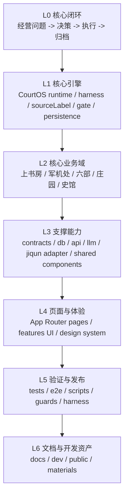

# chaotang-web-lyt 项目内容分层梳理

日期：2026-06-26  
分支：`release`  
仓库：`chaotang-web-lyt` 前端主仓

本文用于快速判断当前项目里“什么是核心，什么是支撑，什么是外围”。核心判断标准不是文件多不多，而是：是否直接参与“经营问题 -> 决策 -> 执行 -> 归档 -> 下次复用”的主闭环。

## 0. 一句话结论

本项目的核心不是页面集合，而是一条 CourtOS 业务闭环：上书房收问题，丞相台压缩议题，军机处会审，三省/人工门做治理，六部给能力，庄园蜂群承接业务战场，真实产线资产转后端 `jiqun:8081`，最后由史馆和 Hermes 记忆沉淀。

## 1. 核心层级总览

## 2. L0：业务核心

### 2.1 主闭环

这是项目最核心的东西，其他目录都应该服务它。

1. 用户在上书房提出经营问题或上传证据。
2. 丞相台把问题压成可裁决议题。
3. 军机处召集相关部门会审，识别冲突、缺证和风险。
4. 治理/人工确认门决定准奏、补证、复核、驳回或追问。
5. 六部提供横向能力判断。
6. 庄园蜂群在具体业务战场承接执行。
7. 触碰报价、BOM、交期、付款、客户承诺等真实产线资产时，转交后端 `jiqun:8081` 或人工确认。
8. 史馆归档，Hermes 记忆反哺下次同类问题。

### 2.2 核心约束

- 面向用户的判断必须带 `sourceLabel`。
- `DEMO` / `FALLBACK` 不能伪装成 `LIVE`。
- 高风险事项必须经过人工确认门。
- 前端只做咨询决策和 Web 承接，不在本仓重建后端产线 flow。
- `/manors` 是庄园蜂群主页；`/departments/*` 是六部业务逻辑页。

## 3. L1：核心引擎代码

这些目录是业务闭环的“发动机”，优先级最高。

| 路径 | 定位 | 是否核心 |
|---|---|---|
| `src/core/courtos/` | CourtOS 主运行时、决策 Loop、部门会审、harness、sourceLabel、persistence | 核心 |
| `src/core/courtos/orchestrator/` | 决策编排与主 loop | 核心 |
| `src/core/courtos/harness/` | AgentHarness、人工审批门、报告质量门 | 核心 |
| `src/core/courtos/runtime/` | jiqun/live swarm adapter、证据绑定、运行时适配 | 核心 |
| `src/core/courtos/unified/` | 统一决策循环、统一 UI adapter、部门 registry | 核心 |
| `src/core/courtos/persistence/` | 决策闭环持久化与归档策略 | 核心 |
| `src/core/courtos/schemas/` | CourtOS 结构校验 | 核心 |
| `src/core/courtos/source-label.ts` | 来源诚实层 | 核心 |

部门专项引擎也属于核心，但优先级低于主 loop：

| 路径 | 业务含义 |
|---|---|
| `src/core/courtos/hubu/` | 户部 CFO / 财务判断 |
| `src/core/courtos/xingbu/` | 刑部 CLO/CCO / 法务合规 |
| `src/core/courtos/gongbu/` | 工部 CTO/CPO / 工程交付 |
| `src/core/courtos/rites/` | 礼部品牌传播 |
| `src/core/courtos/bingbu/` | 兵部竞争/销售/增长 |
| `src/core/courtos/libu/` | 吏部/组织人才 |
| `src/core/courtos/ministries/` | 多部门会审与红蓝循环 |

## 4. L2：核心业务域与入口

### 4.1 核心页面入口

这些是用户理解产品的主舞台。

| 路由 | 文件 | 核心程度 | 说明 |
|---|---|---:|---|
| `/court-briefing` | `src/app/(dashboard)/court-briefing/page.tsx` | P0 | 上书房，经营问题入口 |
| `/command-center` | `src/app/(dashboard)/command-center/page.tsx` | P0 | 军机处，会审与执行调度 |
| `/overview` | `src/app/(dashboard)/overview/page.tsx` | P0 | 大殿，总览 |
| `/departments` | `src/app/(dashboard)/departments/page.tsx` | P0 | 六部总览 |
| `/departments/[code]` | `src/app/(dashboard)/departments/[code]/page.tsx` | P0 | 六部详情 |
| `/manors` | `src/app/(dashboard)/manors/page.tsx` | P0 | 庄园蜂群主页 / 执行中心 |
| `/archive` | `src/app/(dashboard)/archive/page.tsx` | P0 | 史馆归档 |
| `/governance` | `src/app/(dashboard)/governance/page.tsx` | P1 | 三省治理 |
| `/grand-council` | `src/app/(dashboard)/grand-council/page.tsx` | P1 | 大朝会 / 跨部门冲突 |

### 4.2 核心 feature 模块

| 路径 | 定位 | 核心程度 |
|---|---|---:|
| `src/features/shangshufang/` | 上书房 UI 与交互 | P0 |
| `src/features/command-center/` | 军机处工作台 | P0 |
| `src/features/departments/` | 六部总览与详情 | P0 |
| `src/features/manors/` | 庄园业务战场 | P0 |
| `src/features/zhuangyuan/` | 庄园视觉与执行台组件 | P0/P1 |
| `src/features/scribe/` | 史馆复盘与归档 | P0 |
| `src/features/governance/` | 治理与签核 | P1 |
| `src/features/operating-loop/` | 经营对象、预算、复盘、Build Ledger | P1 |

## 5. L3：核心支撑能力

这些不是用户第一眼看到的东西，但一旦错了，核心闭环会失真。

| 路径 | 定位 | 重要点 |
|---|---|---|
| `src/lib/contracts/` | 类型契约 SoT | 新代码优先从这里 import 类型 |
| `src/lib/db/` | 主库、schema、turso/file db | 决策和归档能否闭环的关键 |
| `src/lib/llm/` | LLM router | AI 调用底座 |
| `src/lib/reality/` | reality/source 状态归一 | 防止假数据冒充真实 |
| `src/lib/swarm/` | 部门 agent、路由、merge、ledger | 六部会审基础 |
| `src/lib/server/` | server side upstream / breaker | 外部服务稳定性 |
| `src/lib/api/` | 前端请求层 | 页面数据入口 |
| `src/features/shared/` | 跨页面共享业务组件 | 避免各页重复造核心 UI |
| `src/components/` | 通用 UI 组件 | PageHeader、GlassPanel、DataState 等 |
| `src/config/routes.ts` | 路由注册表 | 导航、分组、路由语义的 SoT |

## 6. L4：页面、体验与外围产品面

这些是产品体验的一部分，但不是所有都属于主闭环核心。

### 6.1 产品扩展面

| 路由/模块 | 定位 | 核心程度 |
|---|---|---:|
| `/hanlin` | 翰林院，Skill 工房与实验孵化 | P1 |
| `/forecast` | 钦天监，趋势推演 | P2 |
| `/intel` | 锦衣卫情报 | P1/P2 |
| `/health` | 太医院/系统健康 | P2 |
| `/reports` | 战报库 | P1 |
| `/scribe` | 史馆复盘工作台 | P1 |
| `/settings` | 设置中心 | P2 |
| `/battery-exchange` | 电池现货台，垂直业务尝试 | P2/业务实验 |

### 6.2 开发者与集成后台

| 路由/模块 | 定位 | 核心程度 |
|---|---|---:|
| `/jiqun/*` | 后端蜂群控制台镜像/集成入口 | P1 支撑，不是老板主入口 |
| `/admin/*` | 管理与皮肤等后台 | P2 |
| `/e2e-harness/*` | 测试页面 | 工程支撑 |
| `/prototype/*` | 原型验证 | 临时/实验 |

## 7. L5：验证、发布与质量门

这些是 release 分支尤其要看的内容。

| 路径/命令 | 用途 |
|---|---|
| `pnpm exec tsc --noEmit` | TypeScript 基础检查 |
| `pnpm build` | Next.js 16 构建与更严格 typecheck |
| `pnpm test:core` | CourtOS 核心 nodetest |
| `pnpm test:e2e` | Playwright E2E |
| `pnpm gate:daily` | 每日主线 gate |
| `pnpm guard:honesty` | 诚实来源/假数据审计 |
| `pnpm guard:freeze` | 学习安全/冻结规则 |
| `pnpm censor` / `pnpm censor:full` | 朝堂纠察与发布前检查 |
| `scripts/chaotang-release-gates.mjs` | 朝堂 release gates |
| `scripts/final-release-harness.mjs` | 最终发布 harness |
| `e2e/` | 用户路径与页面验收 |
| `tests/` | 非页面测试 |

## 8. L6：文档、开发资产与非核心文件

| 路径 | 定位 |
|---|---|
| `docs/` | 正式设计、PRD、验收、历史方案 |
| `dev/notes/` | 临时分析、架构梳理、会审记录 |
| `dev/handoffs/` | 跨 agent / 跨天交接 |
| `dev/release/` | 发布说明与 PR 草稿 |
| `dev/artifacts/` | 机器产物，默认不入库 |
| `dev/screenshots/` | 浏览器验收截图，默认不入库 |
| `public/` | 视觉素材和静态资源 |
| `harness/` | 发布/验证相关辅助 |
| `.agents/`、`.claude/`、`.workbuddy/` | agent/工具状态或配置，不属于业务核心 |

## 9. “核心”判定清单

判断一个文件是否核心，按下面顺序问：

1. 它是否影响主闭环状态流转？
2. 它是否影响 `sourceLabel`、风险、人工确认或证据边界？
3. 它是否写入或读取主库任务、归档、决策结果？
4. 它是否决定六部、庄园、jiqun 的调用边界？
5. 它是否是 P0 页面入口的一部分？
6. 它是否进入 `gate:daily`、`test:core`、E2E 或 release harness？

如果前四项任一为“是”，就是核心。第五项为“是”，是核心体验。第六项为“是”，是核心质量支撑。

## 10. 当前最应保护的核心线

1. `src/core/courtos/**`：不要随意重命名类型、状态或 sourceLabel。
2. `src/lib/contracts/**`：类型 SoT，不要平行造类型。
3. `src/lib/db/**` 与 `src/core/courtos/persistence/**`：闭环是否能回读、归档、复用的关键。
4. `src/features/shangshufang/**` + `/court-briefing`：经营问题入口。
5. `src/features/command-center/**` + `/command-center`：会审与执行调度。
6. `src/features/departments/**` + `/departments/*`：六部能力域。
7. `src/features/manors/**`、`src/features/zhuangyuan/**` + `/manors`：庄园蜂群执行中心。
8. `src/features/scribe/**` + `/archive`：史馆闭环。
9. `scripts/*gate*`、`scripts/*censor*`、`e2e/**`：发布门禁和防退化。

## 11. 不应误判为核心的内容

- 只服务展示的 mock 数据，不是核心事实源。
- `/swarm` 通用说明页不是当前蜂群主页，蜂群主页应认 `/manors`。
- `/jiqun/*` 是开发者/集成后台，不是老板主入口。
- `dev/notes/*` 是分析资产，不应被页面或运行时依赖。
- 视觉素材本身不是业务核心，但已冻结的设计 token 和全局样式属于体验基础设施，不能随意改。

## 12. Advisor 视角

Karpathy 视角：项目最大的复杂度不是页面多，而是“同一业务事实”散落在 runtime、contracts、features、routes 和 docs；先守住 SoT，再谈扩展。

Deming 视角：核心闭环只有被测试和 gate 持续验证才算核心能力，否则只是一次性演示；每个核心箭头都应该有回执字段和回归断言。

🎲 大神视角（Deming）
⚠️ 警示：最容易被低估的风险是把“页面已存在”误当成“业务闭环已成立”，结果 release 时只看到壳，看不到同一个案号的状态流转。
💡 天才建议：给 P0 核心线建立一张 `caseId` 追踪表，从 `/court-briefing` 到 `/archive` 每站只允许一个字段名承接，任何页面拿不到这个字段就直接显示断链。
