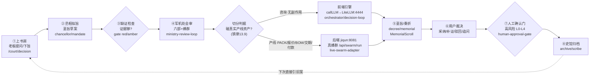
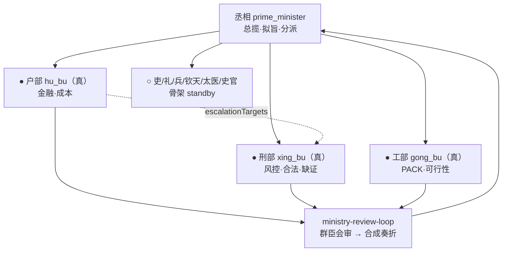

# 朝堂 OS · 交互闭环整图（2026-06-28）

> 从上书房到蜂群的完整闭环 + 各司联络。基于真实代码核实（非想象图）。
> 心法：Loop = 状态 + 动作 + 下一步。AI 在规定的状态机里只执行其中一步。

## 一、主闭环（CourtOS Loop · 铁律13）

## 二、各司联络（11司 · agent.ts Tier0）

## 三、贯穿全线的单一真相源（铁律2 · SSOT）

| 真相源 | 文件 | 作用 |
|---|---|---|
| sourceLabel | `lib/reality/reality-state` | 每个结果带 LIVE/MIXED/FALLBACK/DEMO，禁假冒 |
| tasks 主表 | `lib/db/primary-store` | 下旨即写 tasks，史馆/briefing 读回同 taskId 验闭环 |
| 类型契约 | `lib/contracts/*` | memorial/decree/judgement 跨进程枚举单源 |
| AI 核心 | `lib/llm/router` callLLM | 所有 AI 调用经 AgentHarness，UI 禁直连模型 |

## 四、一句话读懂
老板在①上书房说一句 → ②丞相拟成圣旨 → ③查证据 → ④该咨询的前端答、该动真资产的转⑤后端真蜂群 → ⑤出奏折 → ⑥老板裁决 → ⑦高风险人工确认 → ⑧归档，下次①直接引旧案。闭环靠 tasks 表串联，每步带来源标。

---

## 五、🎲 大神会审 · 评价 / 优缺点

### 优点（真功夫，少见的纪律）
1. **闭环不是聊天玩具，是有纪律的状态机**（张小龙/karpathy）——8 态 + 状态/动作/下一步，AI 只执行一步，不自由发挥。
2. **SSOT + sourceLabel 诚实纪律**（deming）——禁假数据冒充 LIVE、下旨→写 tasks→读回验闭环。这种"拿数据不靠信"的工程纪律业内罕见。
3. **前后端边界判据清晰**（bezos）——"是否碰真实产线资产"切分咨询/产线，是条好的单向门规矩。
4. **治理内建**（schneier）——人工确认门 L0-L4 + 质门 + 缺证门，风险不靠人记。

### 缺点（看着闭环、实则有空边）
1. 🔴 **真实登录断流**（charity-majors）——next-server→后端 login fetch 失败，商家进不去。**整个闭环此刻对真实用户不可用**。最高severity。
2. 🟡 **8/11 司是骨架**（eo-wilson）——会审走到它们就空转。闭环图"看着闭"，实则 8 个节点不真发火。真蜂群涌现只在户/刑/工三司成立。
3. 🟡 **产线右臂存疑**（taleb）——后端 :8081 真蜂群对"碰产线资产"的决策是否真跑通端到端，需实证（旧记忆：执行臂曾故意留白）。
4. 🟢 **复杂度过载**（munger）——一条主 Loop 背 96 页/190 路由，多为骨架，稀释信号（本轮已清 228 文件，仍偏重）。

---

## 六、现在必须要做的事（按 severity 排序）

| P | 必做 | 为什么是"必须" | 判据/出口 |
|---|---|---|---|
| **P0** | **修登录 fetch bug** | 没它，产品"不可用"，闭环/各司/奏折全白搭——这是唯一拦住"能不能用"的门 | local-login 返回 401（到后端）而非 503；真实账号能登入走完①→⑧ |
| **P1** | **给闭环节点亮灯** | 让"闭环是否真闭"可观测：真agent=绿/骨架=灰/断流=红，别自欺 | 一个内部健康页，每条边标真跑/空转 |
| **P1** | **实证产线右臂** | 确认"碰产线资产"的决策真转后端 :8081 真蜂群、有真产出 | 一条产线决策端到端：下旨→后端蜂群→真PACK/报价→读回 |
| **P2** | **骨架司逐个过铁律5** | 8 骨架司"第一条真实数据从哪来"答不出就冻结，别让空转伪装成闭环 | 每司：有真数据源→接真 agent；无→标灰冻结 |

**一句话**：P0 修登录是**唯一现在必须做的**——其余都建立在"用户能进来"之上。先让商家能走完一次①→⑧真闭环，再谈把 8 个骨架节点点亮。
